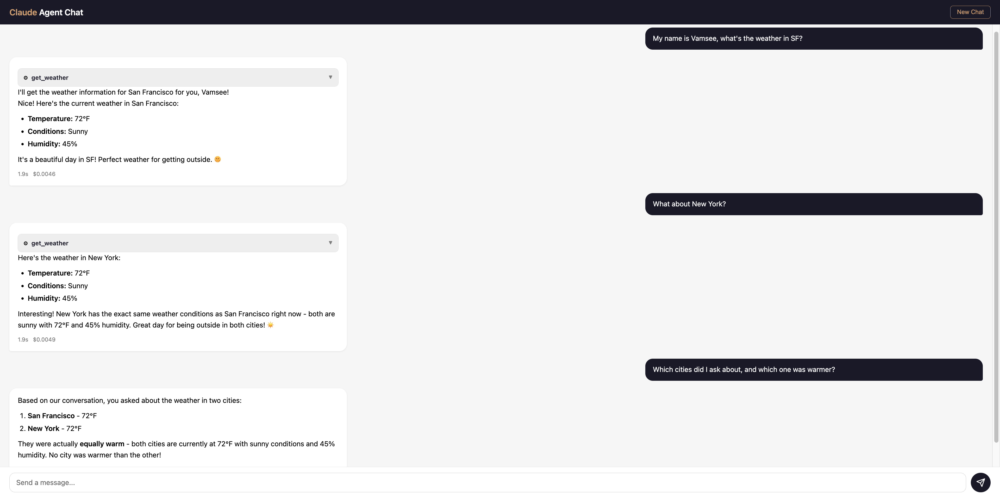

# Claude Agent SDK - Cloud Sessions

The [Claude Agent SDK](https://github.com/anthropics/claude-agent-sdk-python) is the same agentic runtime that powers [Claude Code](https://docs.anthropic.com/en/docs/claude-code). It runs Claude in a reasoning loop where the model can think, call tools, observe results, and decide what to do next - autonomously chaining multiple steps until the task is complete. Unlike a single API call, the agent keeps going: it reads files, runs commands, calls external services via MCP, and self-corrects when things go wrong. This is the same architecture behind Claude Code's ability to navigate entire codebases and ship working code.

This project wraps the Claude Agent SDK behind a REST API so that any client - a web app, mobile app, or another service - can interact with a fully agentic Claude over HTTP. The agent reasons, uses tools, and maintains multi-turn conversations, all through a simple `POST /chat` endpoint. This is how knowledge work gets automated: instead of building brittle pipelines, you give Claude the tools and let the agent figure out the steps.

## Live Demo

Try it out: **[claude-agent-api-376960238767.us-central1.run.app](https://claude-agent-api-376960238767.us-central1.run.app)**



The built-in chat UI shows tool call details, session persistence, and cost/duration per response - no separate frontend needed.

Persistent chat sessions are critical for this to work in production. Users expect to pick up where they left off - whether they're debugging a problem across multiple messages, building on previous analysis, or coming back the next day. Without session persistence, every request starts from scratch and the agent loses all context. This project solves that with a two-layer approach: the SDK's internal session store (`~/.claude/`) is mounted to a GCS bucket via FUSE so it survives container restarts, while Firestore mirrors the conversation history for fast reads and session listing by the API layer.

## Architecture

```
                                    Cloud Run (gen2)
                               ┌─────────────────────────────┐
                               │                             │
                               │   FastAPI                   │
                               │   ┌───────────────────┐     │
     Client                    │   │  POST /chat        │     │
    ┌──────┐    HTTPS          │   │  GET /sessions/:id │     │
    │ Web  │ ──────────────────┤   │  GET /health       │     │
    │ App  │                   │   └────────┬──────────┘     │
    └──────┘                   │            │                │
                               │            v                │
                               │   ┌───────────────────┐     │
                               │   │  Claude Agent SDK  │     │
                               │   │                   │     │
                               │   │  Reasoning Loop:  │     │
                               │   │  Think → Tool →   │     │
                               │   │  Observe → Repeat │     │
                               │   └──┬──────────┬─────┘     │
                               │      │          │           │
                               │      v          v           │
                               │  ┌────────┐ ┌────────────┐  │
                               │  │ MCP    │ │ ~/.claude/  │  │
                               │  │ Tools  │ │ (sessions)  │  │
                               │  │(weather│ └──────┬─────┘  │
                               │  │  etc.) │        │        │
                               │  └────────┘        │        │
                               └────────────────────┼────────┘
                                                    │
                          GCS FUSE mount            │
                          ┌─────────────────────────┘
                          │
              ┌───────────v──────────┐    ┌──────────────────┐
              │   GCS Bucket         │    │   Firestore      │
              │                      │    │                  │
              │   SDK session data   │    │   Conversation   │
              │   (persists across   │    │   history, costs │
              │    container restarts│    │   session listing│
              │    30-day lifecycle) │    │                  │
              └──────────────────────┘    └──────────────────┘
```

**How a request flows:**

1. Client sends `POST /chat` with a message (and optionally a `session_id` to resume)
2. FastAPI passes the message to the Claude Agent SDK's `query()` function
3. The SDK runs Claude in an agentic loop - Claude thinks, decides to call tools (like the weather MCP server), observes results, and continues until it has a final answer
4. The response, tool calls, and session ID are saved to Firestore
5. The SDK's internal session state is persisted to GCS via FUSE mount, so resuming works even after the container is recycled

## API Endpoints

### `GET /`

Chat UI. Open the service URL in a browser to interact with the agent.

### `GET /health`

Health check.

```bash
curl https://<YOUR_SERVICE_URL>/health
# {"status": "healthy"}
```

### `POST /chat`

Send a message. Optionally include `session_id` to continue a conversation.

```bash
# New conversation
curl -X POST https://<YOUR_SERVICE_URL>/chat \
    -H "Content-Type: application/json" \
    -d '{"message": "What is the weather in San Francisco?"}'

# Response
{
    "session_id": "4df335e9-f7ff-4a7f-918e-696eeb46227a",
    "response_text": "The current weather in San Francisco is:\n- Temperature: 72°F\n- Conditions: Sunny\n- Humidity: 45%",
    "tool_calls": [
        {
            "tool_name": "mcp__weather__get_weather",
            "tool_input": {"city": "San Francisco"},
            "tool_result": "Weather in San Francisco: 72°F, Sunny, Humidity: 45%"
        }
    ],
    "is_error": false,
    "cost_usd": 0.031,
    "duration_ms": 3532
}

# Continue conversation
curl -X POST https://<YOUR_SERVICE_URL>/chat \
    -H "Content-Type: application/json" \
    -d '{"message": "How about Tokyo?", "session_id": "4df335e9-f7ff-4a7f-918e-696eeb46227a"}'
```

### `GET /sessions/{session_id}`

Retrieve full conversation history from Firestore.

```bash
curl https://<YOUR_SERVICE_URL>/sessions/<SESSION_ID>
```

## Local Development

```bash
# 1. Clone and set up
git clone <repo-url>
cd claude-agent-sdk-cloud-sessions
python -m venv .venv
source .venv/bin/activate
pip install -r requirements.txt

# 2. Configure
cp .env.example .env
# Edit .env - set ANTHROPIC_API_KEY and GCP_PROJECT_ID

# 3. Run
uvicorn app.main:app --reload

# 4. Test
curl http://localhost:8080/health
curl -X POST http://localhost:8080/chat \
    -H "Content-Type: application/json" \
    -d '{"message": "What is the weather in San Francisco?"}'
```

## Deploy to Cloud Run

Prerequisites: `gcloud` CLI authenticated to your GCP project.

```bash
# Set your project ID
export GCP_PROJECT_ID=your-gcp-project-id
export PROJECT_NUMBER=$(gcloud projects describe $GCP_PROJECT_ID --format="value(projectNumber)")
export BUCKET_NAME=claude-sessions-$GCP_PROJECT_ID

# Enable APIs (one-time)
gcloud services enable firestore.googleapis.com secretmanager.googleapis.com \
    --project=$GCP_PROJECT_ID

# Create Firestore database (one-time)
gcloud firestore databases create --location=us-central1 \
    --project=$GCP_PROJECT_ID

# Store API key as secret (one-time)
echo -n "YOUR_KEY" | gcloud secrets create ANTHROPIC_API_KEY --data-file=- \
    --replication-policy="automatic" --project=$GCP_PROJECT_ID

# Grant service account access to secret (one-time)
gcloud secrets add-iam-policy-binding ANTHROPIC_API_KEY \
    --member="serviceAccount:${PROJECT_NUMBER}-compute@developer.gserviceaccount.com" \
    --role="roles/secretmanager.secretAccessor" \
    --project=$GCP_PROJECT_ID

# Create GCS bucket for session persistence (one-time)
gcloud storage buckets create gs://$BUCKET_NAME \
    --location=us-central1 \
    --project=$GCP_PROJECT_ID \
    --uniform-bucket-level-access

# Add 30-day lifecycle to auto-delete old session data
gcloud storage buckets update gs://$BUCKET_NAME \
    --lifecycle-file=/dev/stdin <<'EOF'
{"rule": [{"action": {"type": "Delete"}, "condition": {"age": 30}}]}
EOF

# Grant service account access to bucket (one-time)
gcloud storage buckets add-iam-policy-binding gs://$BUCKET_NAME \
    --member="serviceAccount:${PROJECT_NUMBER}-compute@developer.gserviceaccount.com" \
    --role="roles/storage.objectAdmin"

# Deploy (repeat for updates)
gcloud run deploy claude-agent-api \
    --source . \
    --region us-central1 \
    --project $GCP_PROJECT_ID \
    --platform managed \
    --allow-unauthenticated \
    --execution-environment gen2 \
    --memory 1Gi --cpu 1 --timeout 300 \
    --set-secrets "ANTHROPIC_API_KEY=ANTHROPIC_API_KEY:latest" \
    --set-env-vars "GCP_PROJECT_ID=$GCP_PROJECT_ID" \
    --min-instances 0 --max-instances 3 \
    --session-affinity \
    --add-volume name=claude-sessions,type=cloud-storage,bucket=$BUCKET_NAME \
    --add-volume-mount volume=claude-sessions,mount-path=/home/appuser/.claude
```

## Project Structure

```
claude-agent-sdk-cloud-sessions/
├── app/
│   ├── main.py              # FastAPI app, lifespan, CORS
│   ├── config.py            # pydantic-settings config from env vars
│   ├── static/
│   │   └── index.html       # Chat UI (served at GET /)
│   ├── routers/
│   │   ├── chat.py          # GET / (chat UI), POST /chat
│   │   ├── sessions.py      # GET /sessions/{session_id}
│   │   └── health.py        # GET /health
│   ├── services/
│   │   ├── agent.py         # Claude Agent SDK query() interaction
│   │   └── firestore.py     # Firestore session CRUD
│   ├── models/
│   │   └── schemas.py       # Pydantic request/response models
│   └── tools/
│       └── weather.py       # @tool decorator + MCP server
├── Dockerfile
├── .dockerignore
├── requirements.txt
├── pyproject.toml
├── .env.example
├── CLAUDE.md                # Project context for Claude Code
└── README.md
```

## Environment Variables

| Variable | Required | Default | Description |
|---|---|---|---|
| `ANTHROPIC_API_KEY` | Yes | - | Anthropic API key |
| `GCP_PROJECT_ID` | Yes | - | Google Cloud project ID |
| `FIRESTORE_COLLECTION` | No | `sessions` | Firestore collection name |
| `CLAUDE_MAX_TURNS` | No | `10` | Max agent conversation turns |
| `CLAUDE_MAX_BUDGET_USD` | No | `0.50` | Max spend per request |
| `CLAUDE_SYSTEM_PROMPT` | No | `You are a helpful assistant...` | System prompt for Claude |
| `PORT` | No | `8080` | Server port |

## Known Limitations

- **Blocking responses**: `POST /chat` blocks until the full agent response completes (typically 3-30s). A future improvement would add SSE streaming.
- **No concurrent session safety**: Two simultaneous requests on the same session may race.
- **Dummy weather tool**: Returns hardcoded data. Replace with a real API for production.
- **No auth**: No user authentication - this is a prototype.
